# Patrones Arquitecturales

## Link a tutorial en video https://drive.google.com/open?id=1-BLGeyFwtMdvFfgv9TWP7c0_i8PDInpO
  
 ## Sitio estático con S3
 
 1. Desde la consola S3 en AWS se crea un nuevo bucket
 
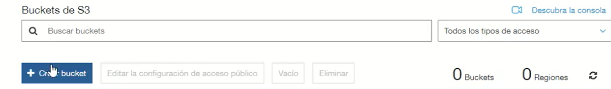

 2. Le ponemos nombre al bucket.
  
 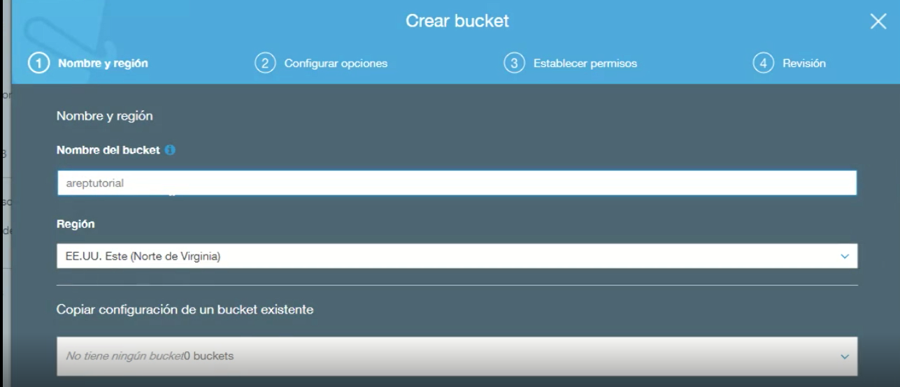
 
 3. Deseleccionamos la opción de Bloquear Acceso Publico
 
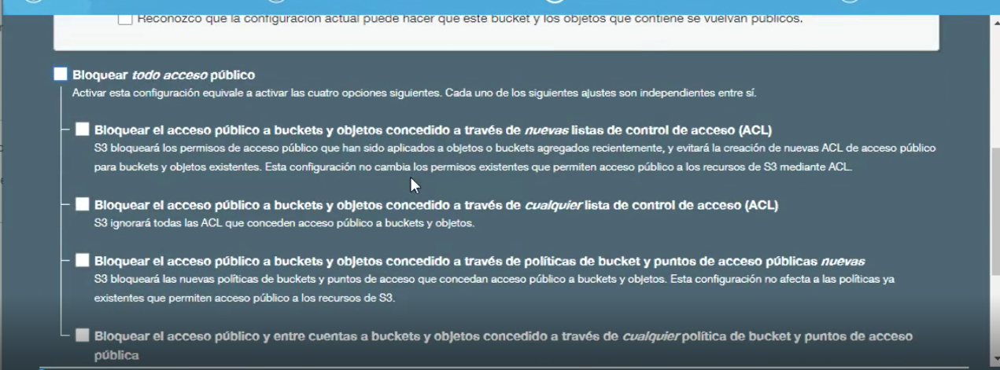

 4. Se suben los archivos de la página web.

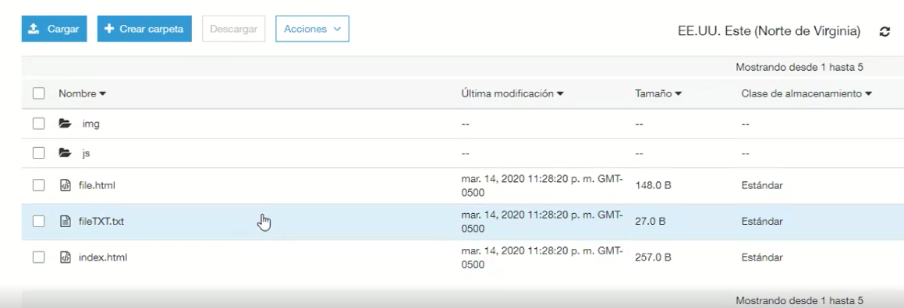
 
 5. Activamos en propiedades el alojamiento de sitios web estaticos.

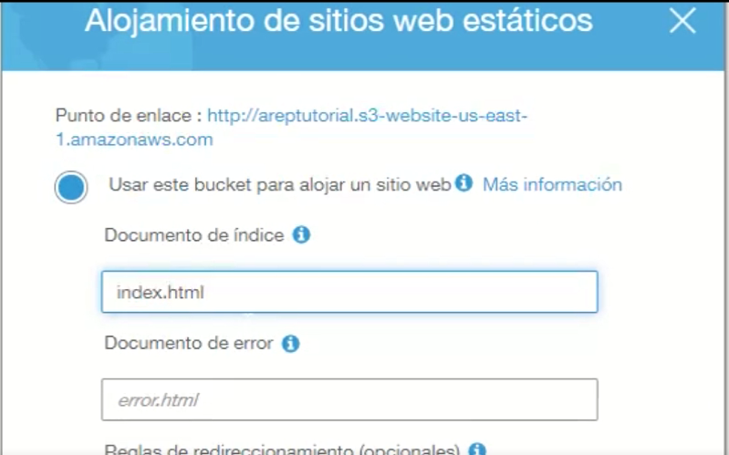
 
 6. En politicas de bucket ponemos esto:

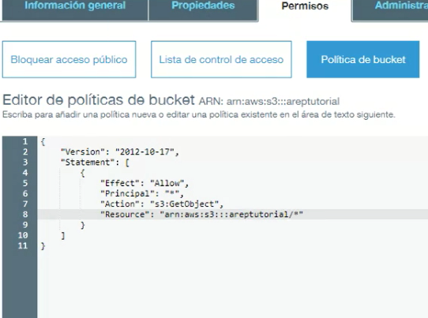
 
 7. Ya estaria creado el sitio estático.

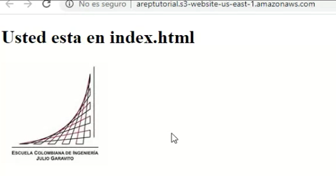
 
 
## VPC de seguridad

1. Desde la consola de EC2 en security group le damos a crear uno nuevo. Le añadimos un nombre y descripción.

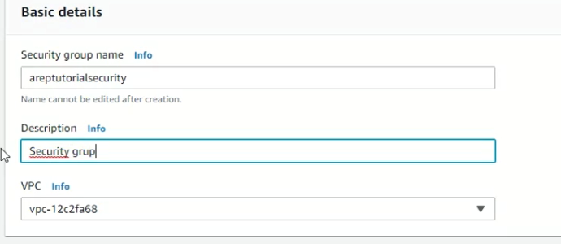

2. Le añadimos las reglas de entrada que queramos.

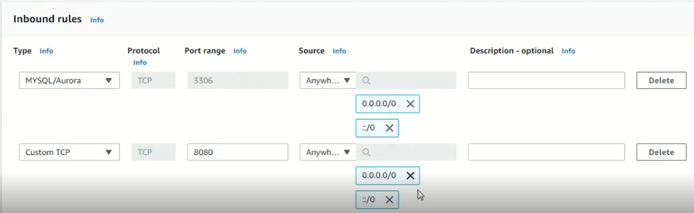

## Base de Datos
1. Desde la consola en RDS le damos a crear una nueva base de datos.

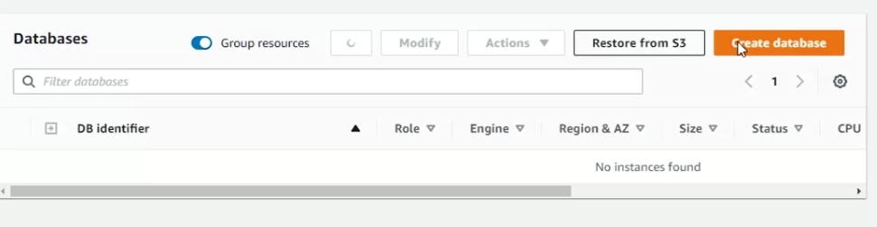

2. Le damos a crear de forma estandar.

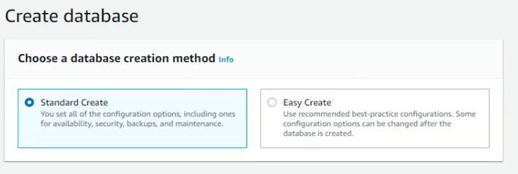

3. Escogemos el motor de base de datos.

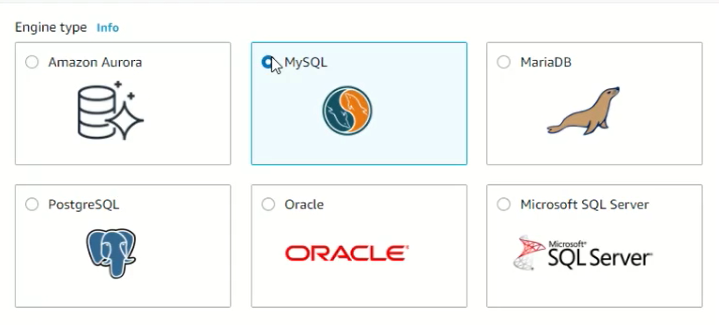

4. Escogemos la opción gratuita.

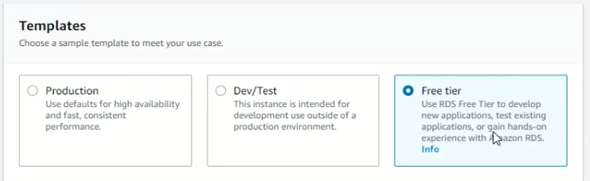

5. Le asignamos las credenciales correspondientes al usuario maestro.

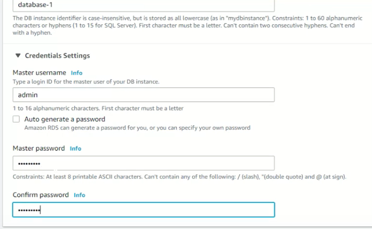

6. Le damos acceso público y le asignamos el grupo de seguridad creado.

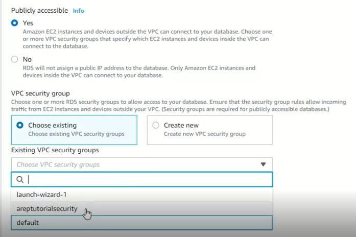

7. Le damos un nombre a la base de datos inicial.

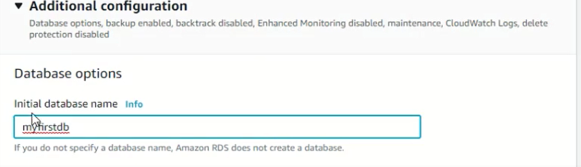
